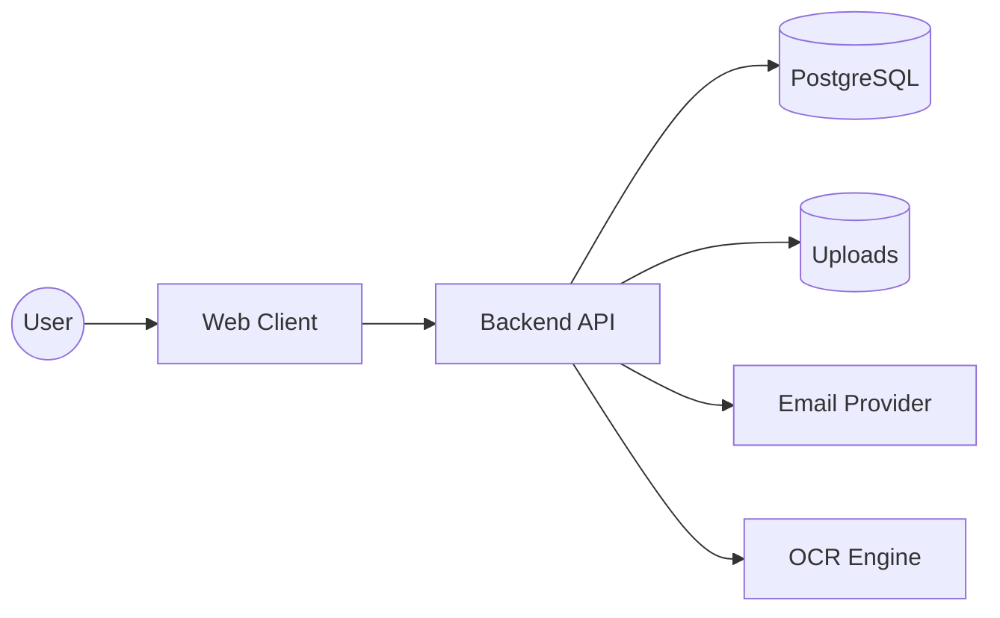
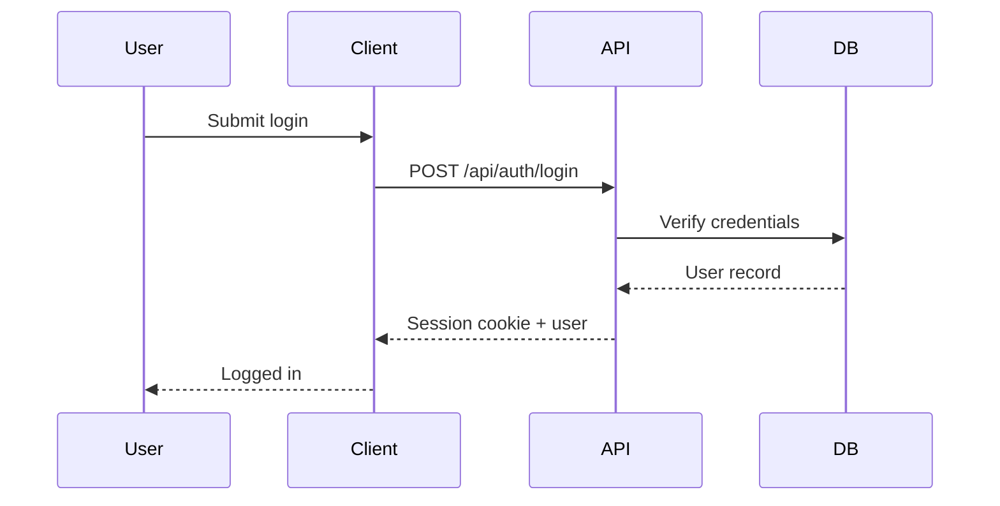
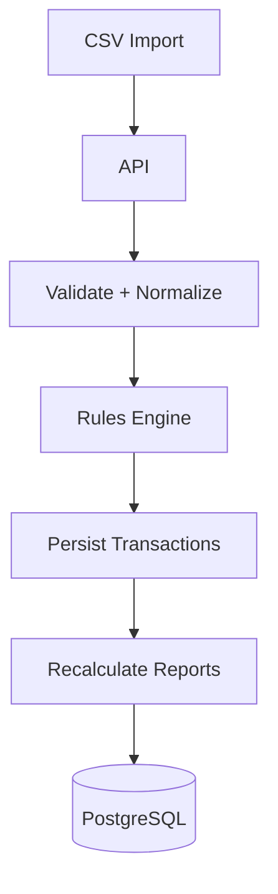
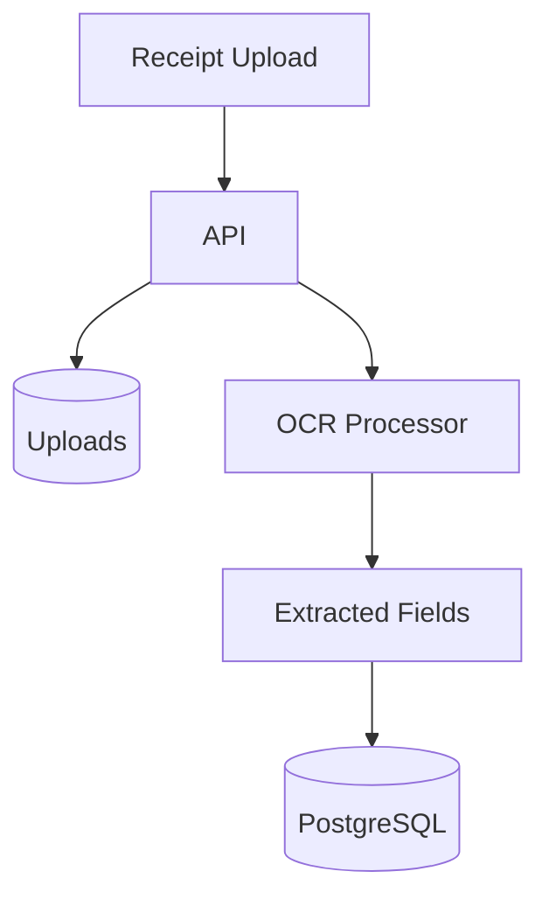
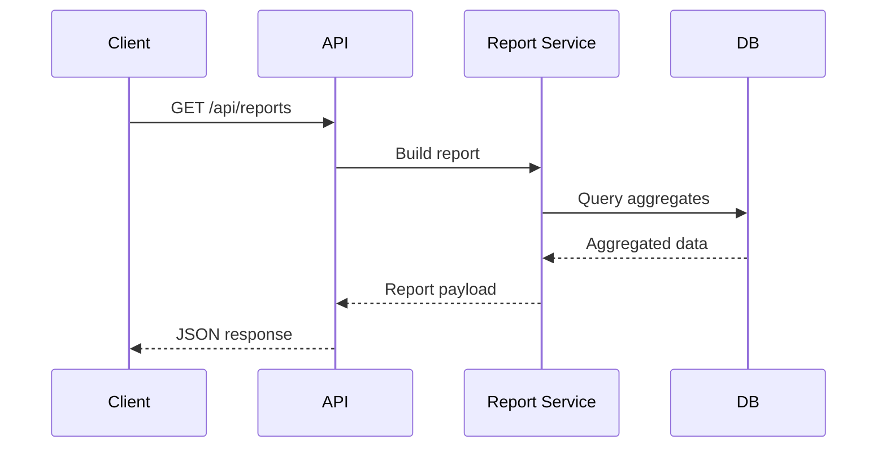

# Data Flows

## System Context

```mermaid
flowchart LR
  User((User)) --> Browser[Web Client]
  Browser --> API[Backend API]
  API --> DB[(PostgreSQL)]
  API --> Files[(Uploads)]
  API --> Mail[Email Provider]
  API --> OCR[OCR Engine]
```

## Authentication Flow

```mermaid
sequenceDiagram
  participant U as User
  participant C as Client
  participant A as API
  participant D as DB

  U->>C: Submit login
  C->>A: POST /api/auth/login
  A->>D: Verify credentials
  D-->>A: User record
  A-->>C: Session cookie + user
  C-->>U: Logged in
```

## Transaction Import + Rule Application

```mermaid
flowchart TD
  Upload[CSV Import] --> API[API]
  API --> Validate[Validate + Normalize]
  Validate --> Rules[Rules Engine]
  Rules --> Store[Persist Transactions]
  Store --> Reports[Recalculate Reports]
  Reports --> DB[(PostgreSQL)]
```

## Receipt Upload + OCR

```mermaid
flowchart TD
  UserUpload[Receipt Upload] --> API[API]
  API --> FileStore[(Uploads)]
  API --> OCR[OCR Processor]
  OCR --> Extract[Extracted Fields]
  Extract --> DB[(PostgreSQL)]
```

## Report Generation

```mermaid
sequenceDiagram
  participant C as Client
  participant A as API
  participant R as Report Service
  participant D as DB

  C->>A: GET /api/reports
  A->>R: Build report
  R->>D: Query aggregates
  D-->>R: Aggregated data
  R-->>A: Report payload
  A-->>C: JSON response
```
